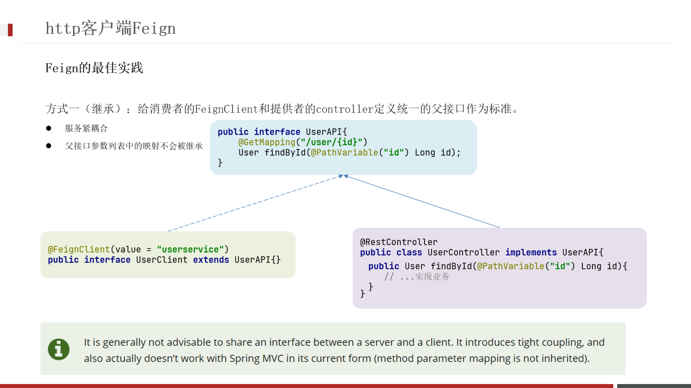
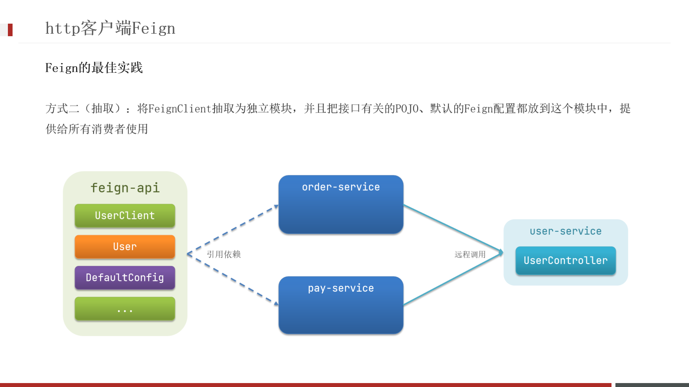

# Feign远程调用

## 使用步骤

- 引入依赖
- 添加 @EnableFeignClients 注解
- 编写 FeignClient 接口
- 使用 FeignClient 中定义的方法代替 RestTemplate

## 日志配置

方式一：配置文件，feign.client.config.xxx.loggerLevel

- 如果xxx是 default 则代表全局

- 如果xxx是服务名称，例如 userservice 则代表某服务

方式二：Java代码配置 Logger.Level 这个 Bean

如果在 @EnableFeignClients 注解声明则代表全局

如果在 @FeignClient 注解中声明则代表某服务

## Feign的优化

**日志级别尽量用 basic**

- 使用**HttpClient**或OKHttp代替URLConnection
- 引入feign-httpClient依赖
- 配置文件开启httpClient功能，设置连接池参数

## 最佳实践

- 让 controller、FeignClient 继承同一接口
- 将 FeignClient、POJO、Feign 默认配置都定义到一个项目中，供所有消费者使用

不同包的FeignClient的导入有两种方式：

- 在 @EnableFeignClients 注解中添加 basePackages，指定 FeignClient 所在的包
- 在 @EnableFeignClients 注解中添加 clients，指定具体 FeignClient 的字节码
